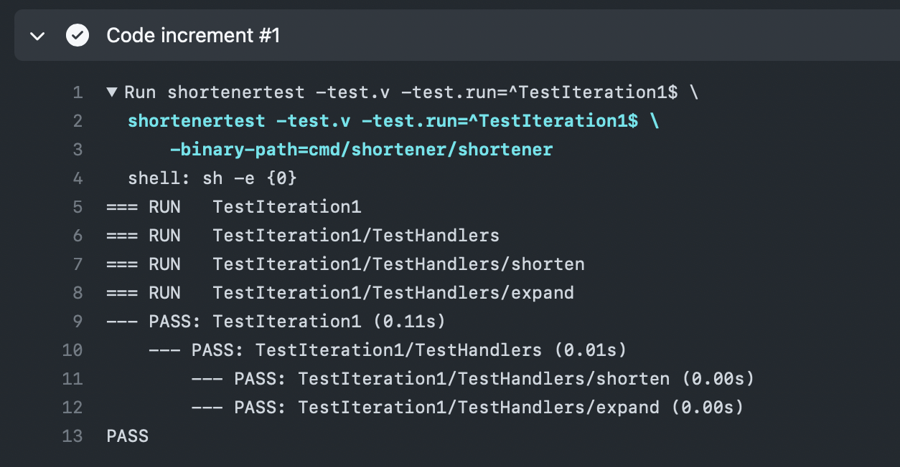

# go-autotests

Автотесты для курса "Go-разработчик".

## Локальный запуск

### Трек "Go и DevOps"

- Скомпилируйте ваши сервер и агент в папках `cmd/server` и `cmd/agent` командами `go build -o server *.go`
  и `go build -o agent *.go` соответственно
- Скачайте [бинарный файл с автотестами](https://github.com/Yandex-Practicum/go-autotests/releases/latest) для вашей
  платформы (например `devopstest-darwin-arm64` - для MacOS на процессоре Apple Silicon)
- Разместите бинарный файл так, чтобы он был доступен для запуска из командной строки (пропишите путь в
  переменную `$PATH`)
- Ознакомьтесь с параметрами запуска автотестов в файле `.github/workflows/devopstest.yml` вашего репозитория,
  автотесты для разных инкрементов требуют различных аргументов для запуска

Пример запуска теста первого инкремента:

```shell
devopstest -test.v -test.run=^TestIteration1$ -agent-binary-path=cmd/agent/agent
```

### Трек "Веб-разработка на Go"

- Скомпилируйте ваш сервер в папке `cmd/shortener` командой `go build -o shortener *.go`
- Скачайте [бинарный файл с автотестами](https://github.com/Yandex-Practicum/go-autotests/releases/latest) для вашей
  платформы (например `shortenertest-darwin-arm64` - для MacOS на процессоре Apple Silicon)
- Разместите бинарный файл так, чтобы он был доступен для запуска из командной строки (пропишите путь в
  переменную `$PATH`)
- Ознакомьтесь с параметрами запуска автотестов в файле `.github/workflows/shortenertest.yml` вашего репозитория,
  автотесты для разных инкрементов требуют различных аргументов для запуска

Пример запуска теста первого инкремента:

```shell
shortenertest -test.v -test.run=^TestIteration1$ -binary-path=cmd/shortener/shortener
```

## Автоматический запуск

На каждый пулл-реквест, созданный в вашем репозитории из одного из шаблонов,с именем подходящим под формат
`iter_N` (где `N` - номер итерации), в контуре Github Actions будут автоматически запущены тесты из данного репозитория.
Будут запущены только тесты до `N` включительно, более поздние тесты будут проигнорированы.

В тестах можно увидеть команду, с помощью которой был запущен тест, а также результат его работы.
В случае успешного прохождения теста вы увидите следующую запись в логе CI:



В случае завершения теста с ошибкой будет выведено подробное сообщение об ошибке:


